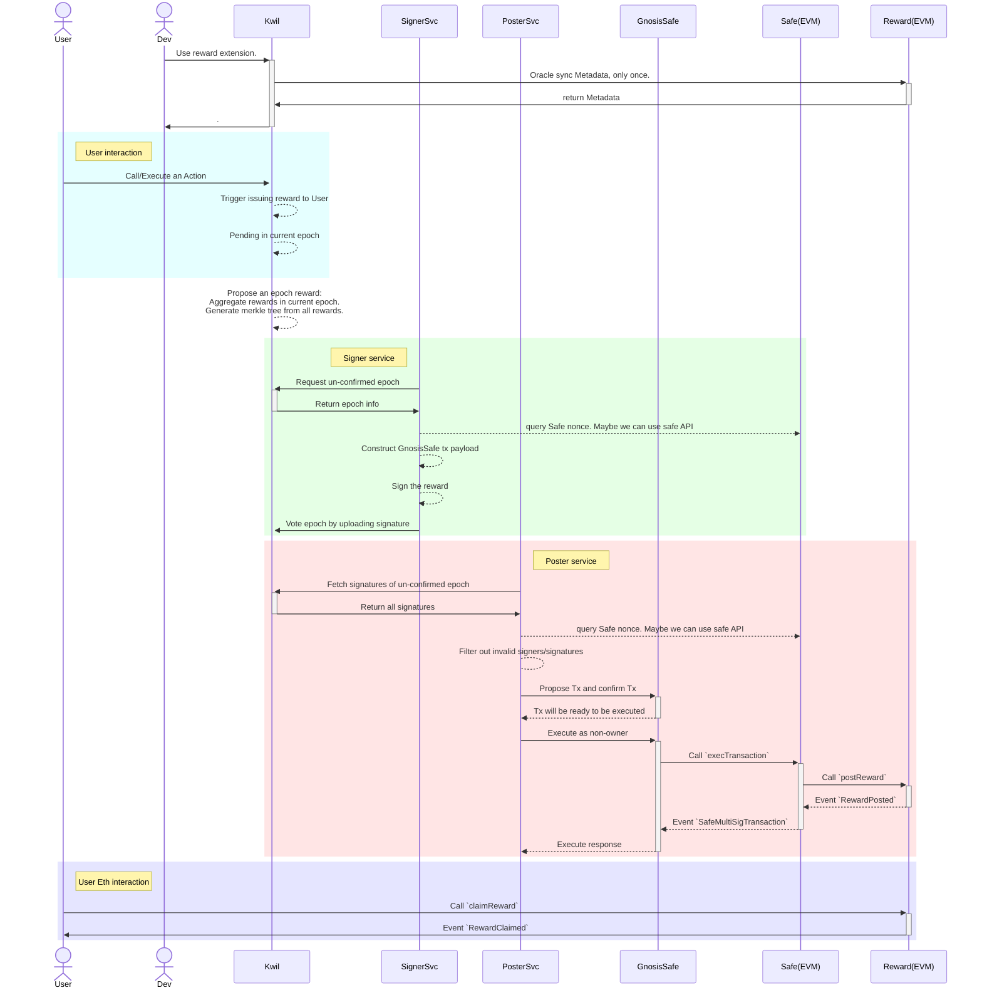

```mermaid
sequenceDiagram
    Actor u as User
    Actor d as Dev
    participant k as Kwil
    participant s as SignerSvc
    participant p as PosterSvc
    participant g as GnosisSafe
    participant sf as Safe(EVM)
    participant r as Reward(EVM)

    d ->>+ k: Use reward extension.
    k ->>+ r: Oracle sync Metadata, only once.
    r ->>- k: return Metadata
    k ->>- d: .

    rect rgba(0, 255, 255, .1)
    Note right of u: User interaction
    u ->>+ k: Call/Execute an Action
    k -->> k: Trigger issuing reward to User
    k -->> k: Pending in current epoch
    end

    k -->> k: Propose an epoch reward: <br> Aggregate rewards in current epoch. <br> Generate merkle tree from all rewards.

    rect rgba(0,255,0,.1)
    Note left of s: Signer service
    s ->>+ k: Request un-confirmed epoch
    k ->>- s: Return epoch info
    s -->> sf: query Safe nonce. Maybe we can use safe API
    s -->> s: Construct GnosisSafe tx payload
    s -->> s: Sign the reward
    s ->> k: Vote epoch by uploading signature
    end

    rect rgba(255,0,0,.1)
    Note right of p: Poster service
    p ->>+ k: Fetch signatures of un-confirmed epoch
    k ->>- p: Return all signatures
    p -->> sf: query Safe nonce. Maybe we can use safe API
    p --> p: Filter out invalid signers/signatures
    p ->>+ g: Propose Tx and confirm Tx
    g -->>- p: Tx will be ready to be executed

    p ->>+ g: Execute as non-owner
    g ->>+ sf: Call `execTransaction`
    sf ->>+ r: Call `postReward`
    r -->>- sf: Event `RewardPosted`
    sf -->>- g: Event `SafeMultiSigTransaction`
    g -->>- p: Execute response
    end

    rect rgba(0,0, 255, .1)
    Note right of u: User Eth interaction
    u ->>+ r: Call `claimReward`
    r ->>- u: Event `RewardClaimed`
    end
```